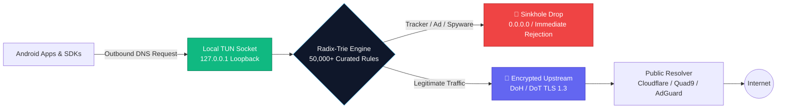

<div align="center">

<a href="https://nullog.fyi" target="_blank">
  
</a>

# NULLOG

### Enterprise-Grade On-Device Privacy Firewall for Android

**Zero Cloud Routing · Zero Telemetry · Zero Compromise**

<p align="center">
  <a href="https://github.com/PrivyXe/NULLOG/releases/tag/1.0.2">
    
  </a>
  <a href="https://developer.android.com/about/versions/oreo">
    
  </a>
  <a href="#">
    
  </a>
  <a href="#">
    
  </a>
  <a href="#">
    
  </a>
</p>

<p align="center">
  <a href="https://github.com/PrivyXe/NULLOG/releases/download/1.0.2/NULLOG-1-0-2.apk">
    
  </a>
  <a href="https://nullog.fyi">
    
  </a>
  <a href="https://t.me/e3x6v">
    
  </a>
</p>

---

<p align="center">
  <em>NULLOG blocks intrusive ads, covert tracking SDKs, and background spyware at the socket level across <strong>every app on your phone</strong> simultaneously. <strong>No root required.</strong></em>
</p>

</div>

<br/>

## 📑 Table of Contents

- [Overview](#-overview)
- [How It Works](#-how-it-works)
- [Key Features](#-key-features)
- [Background Spyware Radar](#-background-spyware-radar)
- [Encrypted DNS (DoH / DoT)](#-encrypted-dns-doh--dot)
- [Architectural Comparison](#-architectural-comparison)
- [Specifications & Benchmarks](#-specifications--benchmarks)
- [Quick Start & Installation](#-quick-start--installation)
- [Privacy Guarantee & Threat Model](#-privacy-guarantee--threat-model)
- [FAQ](#-frequently-asked-questions)
- [Support & Community](#-support--community)

---

## 💡 Overview

Traditional ad blockers only operate inside web browsers, leaving native apps, social media feeds, and mobile games free to harvest user behavior. Conversely, commercial cloud VPNs route all your sensitive network traffic through their external remote servers, forcing you to trust third-party data centers with your personal data.

**NULLOG solves this fundamentally:**
- Intercepts DNS requests locally through an on-device virtual TUN loopback adapter.
- Evaluates domain rules entirely in high-speed device memory (**< 0.4 ms** evaluation time).
- Instantly drops malicious, ad, and tracker connections to `0.0.0.0` (sinkhole) before packets ever touch Wi-Fi or cellular radios.
- Preserves battery cycles and cellular data while delivering zero cloud dependency.

> [!IMPORTANT]
> **100% Offline Core**: NULLOG has **zero tracking servers**, zero telemetry collection, and requires no account or email registration.

---

## ⚙️ How It Works

NULLOG creates a local-only virtual network interface using Android's native `VpnService` API. Rather than tunnelling traffic to a remote cloud proxy, NULLOG performs **in-memory packet evaluation on the device itself**.



1. **Local Interception**: Allocates a virtual loopback socket on the Linux kernel. No remote VPN proxy is contacted.
2. **Radix-Trie Matching**: Outbound hostnames are checked against indexed rules in $O(k)$ time complexity within `< 0.4ms`.
3. **Instant Sinkhole**: Blacklisted analytics endpoints, advertising networks, and surveillance beacons are immediately refused.
4. **Strict TLS Upstream**: Safe queries are forwarded via DNS-over-HTTPS (DoH) or DNS-over-TLS (DoT) to prevent ISP eavesdropping.

---

## ✨ Key Features

### 🛡️ System-Wide Ad & Tracker Blocking
- Blocks banners, interstitial video ads, and analytics beacons across **all installed applications** (not just your browser).
- Powered by curated filter lists including EasyList, EasyPrivacy, Peter Lowe’s Blocklist, and proprietary on-device signatures.
- Completely silent background operation with negligible CPU impact.

### ☕ Silent Sunday Briefing
- **Zero weekday interruption**: NULLOG never bugs you with spammy notifications during your work week.
- Arrives every **Sunday at 20:00** with an executive summary:
  - Total ads, telemetry pings, and tracking domains blocked.
  - Estimated mobile data and CPU bandwidth conserved.
  - One-tap link to inspect detailed 30-day analytics.

### 🎛️ Granular Per-App Firewall Rules
- Individual toggle controls for every package installed on your Android device.
- **Smart Banking Presets**: Automatically whitelists financial institutions and banking apps to prevent false-positive authentication blocks.
- Real-time audit stream showing per-application request and rejection counts.

### 🔋 Battery & Bandwidth Conservation
- Stops heavy background video ads and telemetry scripts from establishing connections.
- Allows device cellular and Wi-Fi modems to enter and remain in deep-sleep mode longer.
- Benchmarked battery consumption is **< 1%** under typical daily workloads.

---

## 🕵️ Background Spyware Radar

Mobile apps frequently embed commercial attribution and analytics SDKs that covertly ping servers when your screen is off. NULLOG identifies and neutralizes these connections at the socket layer:

| SDK / Telemetry Provider | Target Endpoints | Category | Risk Level | Mitigation |
|:---|:---|:---|:---:|:---:|
| **Firebase Analytics** | `firebaselogging-pa.googleapis.com` | Google Telemetry | <span style="color:#F59E0B">MEDIUM</span> | **Sinkholed (0.0.0.0)** |
| **Meta / Facebook SDK** | `graph.facebook.com` | Cross-App Profiling | <span style="color:#EF4444">HIGH</span> | **Sinkholed (0.0.0.0)** |
| **AppsFlyer** | `t.appsflyer.com` | Device Fingerprinting | <span style="color:#EF4444">HIGH</span> | **Sinkholed (0.0.0.0)** |
| **TikTok / Pangle** | `log.musical.ly`, `pangolin-sdk.com` | Behavioral Tracking | <span style="color:#EF4444">HIGH</span> | **Sinkholed (0.0.0.0)** |
| **Adjust Telemetry** | `app.adjust.com` | Attribution Tracking | <span style="color:#F59E0B">MEDIUM</span> | **Sinkholed (0.0.0.0)** |
| **Yandex AppMetrica** | `appmetrica.yandex.com` | Telemetry & Location | <span style="color:#F59E0B">MEDIUM</span> | **Sinkholed (0.0.0.0)** |

---

## 🔐 Encrypted DNS (DoH / DoT)

NULLOG ensures that your internet service provider (ISP), cellular carrier, or local Wi-Fi administrator cannot inspect or manipulate your outbound domain queries.

| Upstream Resolver | Protocol | Port | Encryption | Status |
|:---|:---:|:---:|:---:|:---:|
| **Cloudflare 1.1.1.1** | DoH (`https://`) | 443 | TLS 1.3 / HTTP/2 | ✅ Built-in Active |
| **Quad9 9.9.9.9** | DoT (`tls://`) | 853 | TLS 1.3 / DNSSEC | ✅ Built-in Preset |
| **AdGuard DNS** | DoH (`https://`) | 443 | TLS 1.3 | ✅ Built-in Preset |
| **Custom Endpoint** | DoH / DoT | Configurable | TLS 1.2 / 1.3 | ⚙️ Fully Custom |

---

## 📊 Architectural Comparison

| Dimension | **NULLOG** | Traditional Cloud VPN | Browser Extension | Private DNS (Android) |
|:---|:---:|:---:|:---:|:---:|
| **System-wide App Filtering** | ✅ **Yes (All Apps)** | ✅ Yes | ❌ Browser Only | ⚠️ Basic DNS only |
| **Zero-Log Guarantee** | ✅ **100% On-Device** | ⚠️ Trust Provider | ⚠️ Telemetry Common | ⚠️ Provider Logs DNS |
| **Latency Added** | ⚡ **< 0.4 ms** | ❌ 50 – 150 ms | ⚡ Negligible | ⚡ 10 – 30 ms |
| **Battery Drain** | 🟢 **< 1% Consumption** | 🔴 10 – 25% | 🟢 Minimal | 🟢 None |
| **Background Spyware Blocker** | ✅ **Socket Intercept** | ❌ None | ❌ Browser Only | ⚠️ Basic Host Filtering |
| **Per-App Granular Bypass** | ✅ **Yes (Package Level)**| ⚠️ Rare | ❌ No | ❌ No (System-wide) |
| **Account Required** | 🛡️ **No (Zero Sign-up)** | ❌ Yes | ⚠️ Optional | 🛡️ No |
| **Package Footprint** | 📦 **1.94 MB** | ❌ 30 – 80 MB | 📦 Minimal | 📦 System Component |

---

## 📐 Specifications & Benchmarks

```yaml
Package Size:        1.94 MB (Ultra-compact native binary)
Target OS:           Android 8.0 (API level 26) through Android 15+
Architectures:       Universal (ARM64-v8a, ARMv7, x86_64)
Memory Footprint:    < 32 MB resident RAM load
Lookup Engine:       Radix-Trie in-memory tree (O(k) complexity)
Average Latency:     0.38 ms on mid-tier hardware
Root Requirement:    None (Uses Android VpnService local loopback)
Database Storage:    Encrypted local SQLite (device-only metrics)
Licensing Mechanism: One-way SHA-256 hardware HMAC bound (no email/passwords)
```

---

## 🚀 Quick Start & Installation

### Step 1: Download
Obtain the latest signed APK directly from GitHub Releases:
- 👉 [**Download NULLOG v1.0.2 APK (1.94 MB)**](https://github.com/PrivyXe/NULLOG/releases/download/1.0.2/NULLOG-1-0-2.apk)
- Or visit the release tag: [Release v1.0.2](https://github.com/PrivyXe/NULLOG/releases/tag/1.0.2)

### Step 2: Sideloading Instructions
1. Open the downloaded `.apk` file using your file manager or browser.
2. If prompted, grant **"Install Unknown Apps"** permission in your Android Security Settings.
3. Tap **Install** and complete setup.

### Step 3: Activation
1. Launch **NULLOG**.
2. Tap the central **Shield Button**.
3. Accept the native Android VPN connection prompt.

> [!NOTE]  
> Android requires the `VpnService` permission for any application that inspects socket packets on the device. NULLOG operates **strictly as a local loopback (127.0.0.1)**. None of your network traffic is transmitted to external VPN servers.

---

## 🔒 Privacy Guarantee & Threat Model

- **No Remote Intermediary**: All filtering decisions happen inside device RAM. We operate zero cloud proxy hops.
- **Zero Identifiers**: No Google Analytics, Firebase, Sentry, or third-party telemetry SDKs are bundled inside NULLOG.
- **No User Accounts**: Pro licenses utilize a cryptographic one-way SHA-256 hardware fingerprint signed via server-side HMAC. No email addresses, phone numbers, or credit card records are tied to your device.
- **Local SQLite Storage**: Counter metrics (blocked domains, data saved) are stored exclusively on your device. Clearing app storage erases all records permanently.

---

## ❓ Frequently Asked Questions

<details>
<summary><strong>Why does NULLOG ask for a VPN permission if it's not a VPN?</strong></summary>

Android’s security sandbox prevents apps from monitoring other apps' network queries. The official Android `VpnService` API is the only standard method to create a local virtual network adapter without requiring device root. NULLOG uses this API exclusively as an in-memory loopback to inspect and drop malicious DNS packets locally.
</details>

<details>
<summary><strong>Will NULLOG break my banking or payment applications?</strong></summary>

No. NULLOG has built-in whitelist presets for popular banking, payment, and government authentication apps. You can also manually bypass any specific application under the **App Rules** tab with a single toggle. Bypassed apps connect directly to the network without passing through the filter.
</details>

<details>
<summary><strong>Does it drain my battery?</strong></summary>

No, it actually saves battery. By suppressing heavy video ads, ad auction trackers, and perpetual telemetry polls, your cellular radio and CPU spend more time in low-power idle states.
</details>

<details>
<summary><strong>Can I specify my own NextDNS or Pi-hole resolver?</strong></summary>

Yes. Under the **DNS Settings** tab, select **Custom Resolver** and enter your personal DoH (`https://...`) or DoT (`tls://...`) URI.
</details>

---

## 💬 Support & Community

- 🌐 **Official Website**: [nullog.fyi](https://nullog.fyi)
- 💬 **Telegram Support**: [@e3x6v](https://t.me/e3x6v)
- 🐛 **Issue Tracker**: [GitHub Issues](https://github.com/PrivyXe/NULLOG/issues)
- 📖 **Privacy Guides & Blog**: [nullog.fyi/blog](https://nullog.fyi/blog/)

---

<div align="center">

**© 2026 NULLOG Security Core. All rights reserved.**

*Engineered for individuals who demand uncompromising sovereignty over their devices.*

</div>
