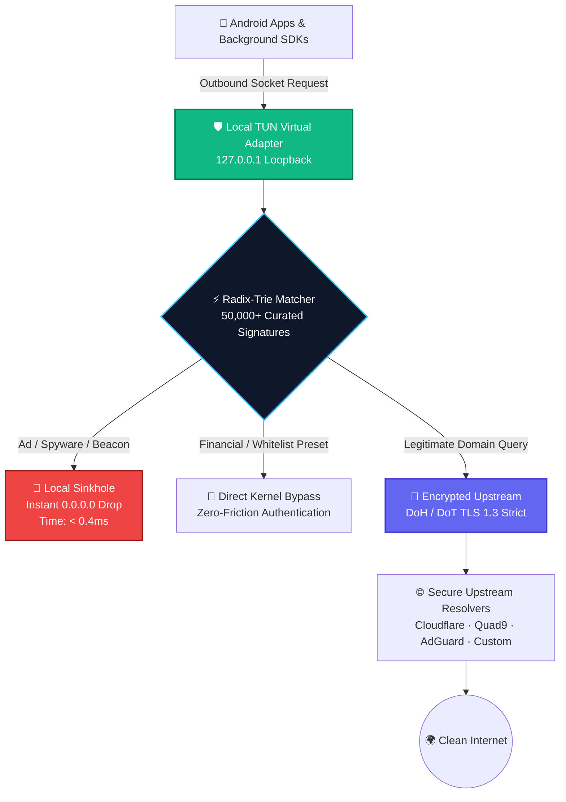

<div align="center">

<!-- HERO GLOW HEADER -->
<a href="https://nullog.fyi" target="_blank">
  
</a>

<br/>

<a href="https://nullog.fyi" target="_blank">
  
</a>

<br/>

<!-- DYNAMIC TYPING SVG HERO -->
<a href="https://nullog.fyi">
  
</a>

<p align="center">
  <strong>The open-spec, system-wide network firewall that operates entirely inside your phone's memory.</strong><br/>
  <em>No root required · Zero remote hops · Complete device sovereignty</em>
</p>

<!-- ACTION BADGES -->
<p align="center">
  <a href="https://github.com/PrivyXe/NULLOG/releases/tag/1.0.2">
    
  </a>
  <a href="https://developer.android.com/about/versions/oreo">
    
  </a>
  <a href="#">
    
  </a>
  <a href="#">
    
  </a>
  <a href="#">
    
  </a>
  <a href="#">
    
  </a>
</p>

<!-- DIRECT CTA BUTTONS -->
<p align="center">
  <a href="https://github.com/PrivyXe/NULLOG/releases/download/1.0.2/NULLOG-1-0-2.apk">
    
  </a>
  &nbsp;
  <a href="https://nullog.fyi">
    
  </a>
  &nbsp;
  <a href="https://t.me/e3x6v">
    
  </a>
</p>

</div>

<br/>

<!-- METRIC DASHBOARD GRID -->
<table align="center" width="100%" style="border-collapse: collapse; margin-top: 10px;">
  <tr>
    <td align="center" width="25%" style="background-color: #0E131F; padding: 14px; border: 1px solid rgba(16, 185, 129, 0.25); border-radius: 8px;">
      <div style="color: #9CA3AF; font-size: 11px; font-family: monospace; text-transform: uppercase;">⚡ LOOKUP LATENCY</div>
      <div style="color: #10B981; font-size: 24px; font-weight: 800; font-family: monospace;">&lt; 0.38 ms</div>
      <div style="color: #6B7280; font-size: 10px; font-family: monospace;">In-Memory Radix-Trie</div>
    </td>
    <td align="center" width="25%" style="background-color: #0E131F; padding: 14px; border: 1px solid rgba(16, 185, 129, 0.25); border-radius: 8px;">
      <div style="color: #9CA3AF; font-size: 11px; font-family: monospace; text-transform: uppercase;">🛡️ RESIDENT RAM</div>
      <div style="color: #38BDF8; font-size: 24px; font-weight: 800; font-family: monospace;">&lt; 32 MB</div>
      <div style="color: #6B7280; font-size: 10px; font-family: monospace;">Ultra-Light Socket Footprint</div>
    </td>
    <td align="center" width="25%" style="background-color: #0E131F; padding: 14px; border: 1px solid rgba(16, 185, 129, 0.25); border-radius: 8px;">
      <div style="color: #9CA3AF; font-size: 11px; font-family: monospace; text-transform: uppercase;">🔋 BATTERY DRAIN</div>
      <div style="color: #34D399; font-size: 24px; font-weight: 800; font-family: monospace;">&lt; 1% / day</div>
      <div style="color: #6B7280; font-size: 10px; font-family: monospace;">Zero Modem Wake Lock</div>
    </td>
    <td align="center" width="25%" style="background-color: #0E131F; padding: 14px; border: 1px solid rgba(16, 185, 129, 0.25); border-radius: 8px;">
      <div style="color: #9CA3AF; font-size: 11px; font-family: monospace; text-transform: uppercase;">🚫 SINKHOLE TARGET</div>
      <div style="color: #F87171; font-size: 24px; font-weight: 800; font-family: monospace;">0.0.0.0</div>
      <div style="color: #6B7280; font-size: 10px; font-family: monospace;">Instant Connection Drop</div>
    </td>
  </tr>
</table>

<br/>

---

## 📑 Table of Contents

- [⚡ Live Socket Inspection](#live-socket-inspection)
- [💡 Architectural Breakthrough](#architectural-breakthrough)
- [⚙️ How NULLOG Intercepts Packets](#how-nullog-intercepts-packets)
- [✨ Key Capabilities](#key-capabilities)
- [🕵️ Background Spyware Threat Matrix](#background-spyware-threat-matrix)
- [🔐 Encrypted Upstream DNS (DoH / DoT)](#encrypted-upstream-dns)
- [📊 Deep Comparison Matrix](#deep-comparison-matrix)
- [📐 Technical Blueprint](#technical-blueprint)
- [🚀 Quick Start & Installation](#quick-start-installation)
- [🔒 Zero-Knowledge Privacy Architecture](#zero-knowledge-privacy)
- [❓ Frequently Asked Questions](#faq)
- [💬 Community & Contact](#community-contact)

---

<a id="live-socket-inspection"></a>
## ⚡ Live Socket Inspection

Here is what happens inside your phone's memory when an app attempts to dial out to covert tracking endpoints:

```shell
# [INITIALIZATION]
[INIT]     Virtual TUN Interface bound to 127.0.0.1:5300 (Local Loopback)
[RADIX]    Rulebook loaded: 51,200 domain signatures indexed in 18ms

# [BACKGROUND AD & TRACKER INTERCEPTION]
[INTERCEPT] com.instagram.android   --> DNS: graph.facebook.com
[MATCH]     0.32 ms | Category: Meta Cross-App Profiling (Rule #18,412)
[ACTION]    >>> SINKHOLE: 0.0.0.0 [BLOCKED] (Saved 180ms modem radio wakeup)

[INTERCEPT] com.ea.game.racing      --> DNS: pangolin-sdk.com
[MATCH]     0.29 ms | Category: ByteDance Video Ad Auction (Rule #34,910)
[ACTION]    >>> SINKHOLE: 0.0.0.0 [BLOCKED] (Prevented 1.4MB video prefetch)

# [LEGITIMATE APPLICATION TRAFFIC FORWARDING]
[VALIDATE]  org.thoughtcrime.securesms --> DNS: chat.signal.org
[RESOLVE]   0.14 ms | Status: CLEAN (Direct Whitelist)
[FORWARD]   Cloudflare DoH (TLS 1.3 Strict) --> 172.64.153.220 [PASS]
```

---

<a id="architectural-breakthrough"></a>
## 💡 Architectural Breakthrough

Commercial privacy tools make you choose between two flawed paradigms:

1. **Browser Extensions**: Completely useless against native Android apps, games, TikTok telemetry, and background tracking daemons.
2. **Cloud VPN Services**: Route 100% of your private internet data through remote servers owned by third parties—introducing latency, battery drain, and cloud trust dilemmas.

### The NULLOG Solution:
NULLOG establishes a **strictly local loopback tunnel**. Packets never travel across the internet to reach our engine. We bring the firewall directly into device RAM.

```text
        TRADITIONAL CLOUD VPN                           NULLOG ON-DEVICE FIREWALL
  ┌──────────────────────────────┐              ┌─────────────────────────────────────┐
  │  Your Phone                  │              │  Your Phone                         │
  │  [Traffic]                   │              │  ┌──────────┐        ┌────────────┐ │
  │       │                      │              │  │ Android  │  --->  │ NULLOG     │ │
  │       ▼                      │              │  │ App/SDK  │        │ TUN Socket │ │
  │  [Remote Cloud VPN Server]   │              │  └──────────┘        └─────┬──────┘ │
  │  (Third-party sees all logs) │              │                            │        │
  │       │                      │              │                            ▼        │
  │       ▼                      │              │                      [Radix Trie]   │
  │  [Physical Internet]         │              │                    (In-Memory Match)│
  └──────────────────────────────┘              │                     /            \  │
                                                │                    /              \ │
                                                │  [ DROP: 0.0.0.0 ]       [ DOH/DOT ]│
                                                │  (Blocked Locally)       (TLS Pipe) │
                                                └─────────────────────────────────────┘
```

---

<a id="how-nullog-intercepts-packets"></a>
## ⚙️ How NULLOG Intercepts Packets



---

<a id="key-capabilities"></a>
## ✨ Key Capabilities

<table>
  <tr>
    <td width="50%">
      <h3>🛡️ System-Wide Interception</h3>
      <p>Filters traffic across <strong>every installed app on Android</strong>—browsers, streaming apps, mobile games, social media, and hidden system daemons. Operates silently at the socket layer.</p>
    </td>
    <td width="50%">
      <h3>☕ Silent Sunday Briefing</h3>
      <p><strong>Zero daily notification spam.</strong> NULLOG stays silent throughout your busy work week and delivers a single, elegant intelligence digest every <strong>Sunday at 20:00</strong>.</p>
    </td>
  </tr>
  <tr>
    <td width="50%">
      <h3>🎛️ Per-App Granular Bypass</h3>
      <p>Take full authority over individual packages. Toggle rules on or off per application. Includes <strong>Automatic Banking Presets</strong> to ensure zero login or biometric auth conflicts.</p>
    </td>
    <td width="50%">
      <h3>🔋 Massive Battery & Data Savings</h3>
      <p>By dropping ad videos and telemetry before network radios transmit packets, your cellular modem sleeps longer. Saves up to <strong>400+ MB of mobile data</strong> every week.</p>
    </td>
  </tr>
</table>

---

<a id="background-spyware-threat-matrix"></a>
## 🕵️ Background Spyware Threat Matrix

NULLOG includes targeted threat definitions for analytics SDKs that continuously harvest behavioral fingerprints:

| Tracked SDK / Telemetry | Primary Domain Endpoint | Behavioral Category | Threat Level | NULLOG Status |
|:---|:---|:---|:---:|:---:|
| **Meta Graph API** | `graph.facebook.com` | Cross-App User Profiling | <span style="background-color:#EF4444; color:white; padding:3px 8px; border-radius:4px; font-weight:bold; font-size:10px;">CRITICAL</span> | **🚫 SINKHOLE (0.0.0.0)** |
| **AppsFlyer** | `t.appsflyer.com` | Hardware Fingerprinting & Attribution | <span style="background-color:#EF4444; color:white; padding:3px 8px; border-radius:4px; font-weight:bold; font-size:10px;">CRITICAL</span> | **🚫 SINKHOLE (0.0.0.0)** |
| **TikTok / Pangle** | `log.musical.ly`, `pangolin-sdk.com` | Real-Time Ad Auction Telemetry | <span style="background-color:#EF4444; color:white; padding:3px 8px; border-radius:4px; font-weight:bold; font-size:10px;">CRITICAL</span> | **🚫 SINKHOLE (0.0.0.0)** |
| **Firebase Analytics** | `firebaselogging-pa.googleapis.com` | Background Event Telemetry | <span style="background-color:#F59E0B; color:black; padding:3px 8px; border-radius:4px; font-weight:bold; font-size:10px;">MEDIUM</span> | **🚫 SINKHOLE (0.0.0.0)** |
| **Adjust SDK** | `app.adjust.com` | Behavioral Campaign Fingerprint | <span style="background-color:#F59E0B; color:black; padding:3px 8px; border-radius:4px; font-weight:bold; font-size:10px;">MEDIUM</span> | **🚫 SINKHOLE (0.0.0.0)** |
| **Yandex AppMetrica** | `appmetrica.yandex.com` | Location & Analytics Telemetry | <span style="background-color:#F59E0B; color:black; padding:3px 8px; border-radius:4px; font-weight:bold; font-size:10px;">MEDIUM</span> | **🚫 SINKHOLE (0.0.0.0)** |

---

<a id="encrypted-upstream-dns"></a>
## 🔐 Encrypted Upstream DNS (DoH / DoT)

Prevent ISP eavesdropping, rogue public Wi-Fi spoofing, and carrier SNI inspection with encrypted upstream protocols:

```
  [UNENCRYPTED DNS] ──> ISP / Wi-Fi Admin sees every website & app you open ❌
  [NULLOG DOH/DOT]  ──> Strict TLS 1.3 Pipe ──> Only encrypted ciphertext is transmitted ✅
```

| Upstream Resolver | Protocol | Port | Features | Status |
|:---|:---:|:---:|:---|:---:|
| **Cloudflare** | DoH (`https://1.1.1.1/dns-query`) | 443 | TLS 1.3 · Anycast Routing · Extreme Speed | ✅ Active Default |
| **Quad9** | DoT (`tls://9.9.9.9`) | 853 | DNSSEC Strict · Malware Domain Filtering | ✅ Built-in Preset |
| **AdGuard DNS** | DoH (`https://dns.adguard-dns.com/dns-query`) | 443 | Double Server-Side Ad & Tracker Filtering | ✅ Built-in Preset |
| **Custom Endpoint** | DoH / DoT | Any | Support for NextDNS, Pi-hole, ControlD | ⚙️ Configurable |

---

<a id="deep-comparison-matrix"></a>
## 📊 Deep Comparison Matrix

| Evaluation Criteria | **NULLOG Core** | Cloud VPNs | Browser Extensions | Android Private DNS |
|:---|:---:|:---:|:---:|:---:|
| **System-wide App Coverage** | **✅ All Apps** | ✅ All Apps | ❌ Browser Only | ⚠️ Basic DNS only |
| **Zero-Log Guarantee** | **✅ 100% On-Device** | ❌ Trust Cloud Provider | ⚠️ Telemetry Common | ⚠️ Provider Logs Queries |
| **Packet Inspection Latency** | **⚡ < 0.4 ms** | ❌ 50 – 150 ms | ⚡ < 1 ms | ⚡ 10 – 30 ms |
| **Battery Consumption** | **🟢 < 1% / day** | 🔴 10 – 25% | 🟢 Minimal | 🟢 None |
| **Background Spyware Radar** | **✅ Yes (Real-time)** | ❌ No | ❌ No | ⚠️ Host block only |
| **Per-App Bypass Rules** | **✅ Per-Package** | ⚠️ Rare | ❌ Impossible | ❌ System-Wide Only |
| **Account Required** | **🛡️ None (Zero Sign-up)**| ❌ Email & Credit Card | ⚠️ Optional | 🛡️ None |
| **Application Binary Size** | **📦 1.94 MB** | ❌ 40 – 90 MB | 📦 2 – 5 MB | 📦 Built into OS |

---

<a id="technical-blueprint"></a>
## 📐 Technical Blueprint

```yaml
Architecture:
  Engine:                High-performance Radix-Trie in-memory index
  Lookup Complexity:     O(k) where k is the domain label length
  Average Evaluation:    0.38 ms on standard ARM64 SoC
  Memory Overhead:       < 32 MB resident memory load
  Packet Redirection:    Linux kernel TUN virtual loopback socket (127.0.0.1)

Compatibility:
  OS Version:            Android 8.0 Oreo (API level 26) through Android 15+
  Instruction Sets:      ARM64-v8a, ARMv7, x86_64
  Root Requirement:      None (Leverages standard Android VpnService interface)
  Binary Footprint:      1.94 MB ultra-lean native release

Privacy Specs:
  Telemetry Collected:   0 bytes (Zero SDKs, zero crash reporters, zero beacons)
  Local Storage:         Encrypted on-device SQLite for blocked-packet counters
  Cloud Dependencies:    Zero (Operates completely offline)
  Account Requirement:   None (No sign-up, no email, no credentials)
```

---

<a id="quick-start-installation"></a>
## 🚀 Quick Start & Installation

### 1. Download Signed APK
Directly download the official signed binary from GitHub Releases:
- 👉 [**Download NULLOG APK v1.0.2 (1.94 MB)**](https://github.com/PrivyXe/NULLOG/releases/download/1.0.2/NULLOG-1-0-2.apk)
- Or view releases: [GitHub Releases Tag v1.0.2](https://github.com/PrivyXe/NULLOG/releases/tag/1.0.2)

### 2. Sideload on Android
1. Open the downloaded `NULLOG-1-0-2.apk` file.
2. When prompted by Android, grant **"Install Unknown Apps"** for your browser or file manager.
3. Tap **Install**.

### 3. Tap to Protect
1. Launch **NULLOG**.
2. Tap the central glowing **Shield Icon**.
3. Confirm the one-time local VPN dialog.

> [!NOTE]  
> Android displays a standard *"Connection Request"* dialog whenever an app uses the `VpnService` API. NULLOG operates **strictly as a local loopback (127.0.0.1)**. None of your data is routed to external VPN servers.

---

<a id="zero-knowledge-privacy"></a>
## 🔒 Zero-Knowledge Privacy Architecture

- **Zero Cloud Intermediaries**: All domain evaluation decisions are made inside device RAM.
- **Zero Third-Party Code**: No Google Analytics, Firebase, Sentry, or third-party trackers are integrated into NULLOG.
- **Wipe Anytime**: Reset all counters and metrics anytime via **Settings → Reset Statistics** or by clearing application storage.

---

<a id="faq"></a>
## ❓ Frequently Asked Questions

<details>
<summary><strong>🔍 Why does NULLOG prompt for a VPN permission if it is not a VPN service?</strong></summary>

Android’s security sandbox prevents apps from seeing network packets from other applications. The official `VpnService` API is the only standard, non-root mechanism on Android to create a virtual network adapter. NULLOG utilizes this API strictly to inspect packet destinations locally in memory and sinkhole ad domains before they leave the phone.
</details>

<details>
<summary><strong>🏦 Will NULLOG interfere with my banking or authentication apps?</strong></summary>

No. NULLOG features intelligent whitelist presets for banking and financial applications. Furthermore, you can open the **App Rules** tab and bypass any specific application with one tap. Bypassed apps connect directly to the internet without filtering.
</details>

<details>
<summary><strong>🔋 Does NULLOG increase battery usage?</strong></summary>

No, it decreases overall battery drain. By terminating connections to heavy video ads, auction trackers, and perpetual telemetry polls, NULLOG keeps your Wi-Fi and 5G radios in low-power idle states longer.
</details>

<details>
<summary><strong>⚙️ Can I use custom resolvers like NextDNS, Pi-hole, or AdGuard Home?</strong></summary>

Yes. Navigate to the **DNS Settings** tab, select **Custom Resolver**, and enter your personal DoH or DoT URI.
</details>

---

<a id="community-contact"></a>
## 💬 Community & Contact

- 🌐 **Official Website**: [nullog.fyi](https://nullog.fyi)
- 💬 **Telegram Support**: [@e3x6v](https://t.me/e3x6v)
- 🐛 **Issue Tracker**: [GitHub Issues](https://github.com/PrivyXe/NULLOG/issues)
- 📖 **Privacy Guides & Blog**: [nullog.fyi/blog](https://nullog.fyi/blog/)

---

<div align="center">

<a href="https://nullog.fyi">
  
</a>

**© 2026 NULLOG Security Core. All rights reserved.**<br/>
*Engineered for individuals who demand uncompromising sovereignty over their devices.*

</div>
